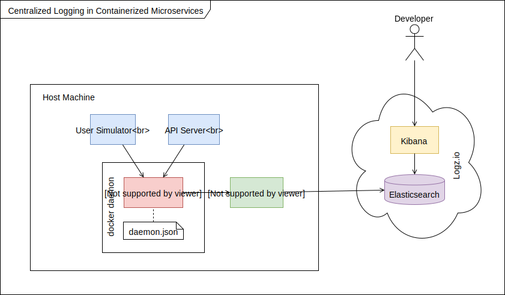

# Horus

A test project for learning microservices observability through: **centralized logging** and **distributed tracing**.

## Requirements

- Docker Compose v1.23.2
- OSX or GNU/Linux operating system

## Development Setup

1. Clone this repo and open the root folder in an IDE like *Visual Studio Code*.

2. For each microservice, rename `example.env` to `.env` and supply the needed secrets.
    > TODO: Is there a way to eliminate this friction?

3. Start all microservices in *development mode*.

        docker-compose -f docker-compose.dev.yml \
            up -d --build

    > Development mode is important for 2 reasons.
    > - Changes to a service's source files will automatically restart/rebuild the docker service to show the changes.
    > - You can attach a remote debugger from your IDE to the docker process for seemless debugging like placing breakpoints and watching variables.
    > - NOTE: When you edit a service's source files, the docker process will restart, severing your remote debugger connection. So, you'd need to reattach the debugger again.

4. Attach the IDE's debugger to the desired service. Follow these steps in Visual Studio Code: *shift+cmd+D > Select a debug configuration > F5*.
    > All Visual Studio Code debug configurations are stored in *.vscode/launch.json*. You can modify configs as you see fit.

5. To view tracing information, access the Jaeger UI on http://localhost:16686

    > In development, the tracing backend is a single service (*tracing-backend*) for simplicity, and traces are stored in-memory. However, in production, the tracing backend will setup as multiple services (running on multiple containers), and traces will be persisted in an external store like Elasticsearch.

### Useful dev commands

    # list all running services
    docker-compose -f docker-compose.dev.yml ps

    # stop all services
    docker-compose -f docker-compose.dev.yml down

    # restart only all [or specific] service
    docker-compose -f docker-compose.dev.yml \
        up -d --no-deps --build [service-name]

    # tail logs from all [or specific] service
    docker-compose -f docker-compose.dev.yml \
        logs -f [service-name]

## Production Setup

TODO

- Signup with an ELK SaaS provider like [Logz.io](logz.io) to obtain an authentication token. Then for each microservice, rename `example.env` to `.env` and supply the needed secrets.
- Then log into your ELK SaaS and view your microservices logs.

## Project Documentation

### System Architecture

I wrote an accompanying [article](https://hackernoon.com/monitoring-containerized-microservices-with-a-centralized-logging-architecture-ba6771c1971a) explaining this architecture.

## Notes

- You can update a single service/container while the entire suite is running using the following command

        docker-compose -f docker-compose.dev.yml \
            up -d --no-deps --build <service_name>

        docker-compose -f docker-compose.prod.yml \
            up -d --no-deps --build <service_name>

    > `--build` recreates the container from its image/dockerfile and `--no-deps` ensures dependent services aren't affected.

### Docker Networking

By default each containerized process runs in an isolated network namespace. For inter-container communication, place them in the same network namespace...as seen in *docker-compose.yml*.

### Best practices

1. You can pass secrets for a microservice using the `env_file` attribute in *docker-compose.yml*.
2. Microservices can communicate using their service names if they are in the same docker network.

### How do you debug an app running in a container (i.e breakpoints and watch variables etc.)?
?
- You can tail the logs from all services using `docker-compose [-f <file>] logs -f`.

### Improvement Considerations

1. **Name Duplication:** The value of the `API_SERVER_ADDRESS` variable in *user-simulator/.env* depends on the service name `api-server` specified in *docker-compose.yml*. If we rename the service, we must also change the variable. Is there a way to make this DRY?

2. In the log-shipper container, I had to install a logz.io-specific plugin. Can't this step be eliminated since fluentd is capable of connecting to https endpoints without plugins?

3. Use sub-second precision for fluentd timestamps (probably best to use nanoseconds.)

### Environment variables used by Jaeger components

1. [jaeger-client-node](https://github.com/jaegertracing/jaeger-client-node#environment-variables)

        JAEGER_SERVICE_NAME
        JAEGER_SAMPLER_TYPE
        JAEGER_SAMPLER_PARAM
        JAEGER_AGENT_HOST
        JAEGER_AGENT_PORT
        JAEGER_ENDPOINT

2. Jaeger Agent
        TODO

3. Jaeger Collector (and a Storage Backend)
        TODO

4. Jaeger Query Service and UI
        TODO

## Some References

https://medium.com/lucjuggery/docker-in-development-with-nodemon-d500366e74df
https://blog.risingstack.com/how-to-debug-a-node-js-app-in-a-docker-container/
https://codefresh.io/docker-tutorial/debug_node_in_docker/
https://code.visualstudio.com/docs/editor/debugging