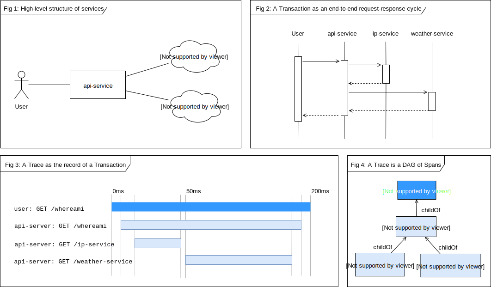
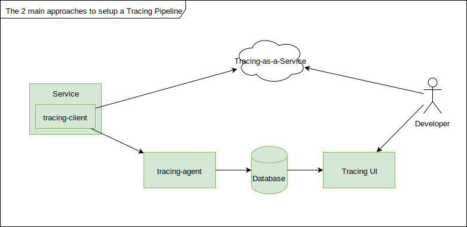
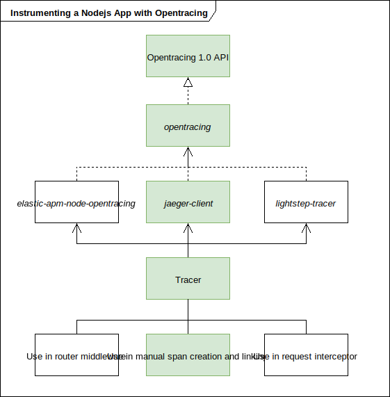
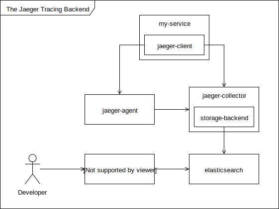
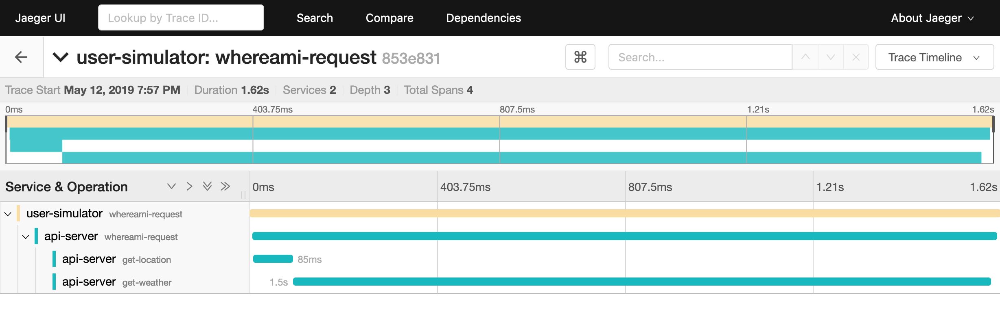

# Microservices Observability with Distributed Tracing.
A continued study of Project Horus.

## Introduction

Generally speaking, there are 3 ways of collecting data for observing microservices: *Metrics*, *Logging*, and *Distributed tracing* [^ben1]. In an earlier article I examined an architecture for setting up logging on our running example *Project Horus* [^first_article]. Now we continue our journey on observability by adding distributed tracing to our microservices.

In addition to examining the theory and principles of distributed tracing, we will setup a complete tracing pipeline for observing  two Node.js microservices running in a Docker environment. The core principles are platform agonositic and can indeed be used on heterogenous services running in a Kubernetes cluster.

However, beware that observability involves more than capturing traces, we must also be able to interpret this data for timely business decisions. This is an ongoing area of research that this article will only briefly cover.

## What is Distributed Tracing?

In simple terms, Distributed Tracing is about understanding the path of a request as it propagates through the microservices in our application. While logging can inform us of important events when servicing a request, tracing tells us the full story about how that request was handled across all services from start to finish.

As an analogy, logs are like alerts on a roadtrip. You only want to be notified when something important happens like road closures and severe weather conditions. But tracing is the complete route of your journey: what towns you visited, what roads you took etc. Indeed you could enrich your trace by annotating it with logs of important events.

But tracking requests across heterogeneous services presents unique challenges, especially at scale. We want a solution that is portable, simple to implement, and with little performance overhead. The *OpenTracing* project was created to tackle these issues [^opentracing1].

## The Terminology of Opentracing



The above images show various perspectives of our sample application. The application allows a user to request information about their location. The request is handled by an *api-service*, which first translates the user's IP address to a city name using a 3rd party *ip-service*. Secondly, it obtains the latest weather information for that city from a 3rd party *weather-service*. Finally the combined information is returned to the user.

A *Transaction* is an end-to-end request-response flow, i.e from making the user's initial request to receiving the final location and weather response. A transaction often involves the interaction of multiple services—Fig 2 shows 4 services collaborating to enable one transaction.

A *Trace* is the record of a transaction. It captures the work done by each service as *Spans*—Fig 3 shows a trace with 4 spans. While a span is unfinished, we could do some external work and capture these as children spans. Hence as Fig 4 shows, a trace can also be viewed as a directed acyclic graph (DAG) of spans.

A *SpanContext* is perhaps the most important concept to understand. It is the edge that connects 2 spans to form a DAG as in Fig 4. Practically, it is a reference to a parent span. When propagating a trace from one service to another, you *inject* the SpanContext into the request's headers and extract them in the receiving service, then you can create a child span referencing the extracted parent ID.

The Opentracing Specification provides a more technical description of these concepts[^opentracing_spec], but the above overview is sufficient to proceed with setting up tracing.

## Setting up a tracing pipeline

Setting up tracing involves 3 steps: acquiring a trace, storing the trace, and later visualizing the trace. The image below shows the two alternative approaches for setting up of a tracing pipeline. Generally, you instrument your service with a client library that provides a Tracer object with which you can create and link Spans. The client library then sends the tracing data to either an agent or a cloud endpoint. Eventually the traces are stored in a database like Elasticsearch, and can be queried using a UI client.



The strategy using a Tracing SaaS provider is obviously simpler as it offloads the complexity of managing a tracing agent, database, and query UI. However, I've chosen the alternative self-managed approach highlighted in green. Just so we can understand how everything works behind the scenes.

### Step 1: Acquiring traces using the Jaeger Client

You acquire a trace by instrumenting your services with a client library that captures Opentracing-compliant tracing data. We would be using the *jaeger-client* [^jaeger-client] package which implements the Opentracing 1.1 API by extending the *opentracing*  [^opentracing-pkg] reference implementation. The Jaeger Client library exposes a Tracer object which we use to construct and send spans to a tracing backend. 

Some alternative client libraries are *lightstep-tracer* [^lightstep-pkg] and *elastic-apm-node-opentracing* [^elastic-pkg]. The image below shows various instrumentation paths we could take, I have chosen to follow the path highlighted in green.



First we need to import a *Tracer* object provided by *jaeger-client* in both services. The tracer will be used to create spans later.

```js
/* in each service */

var opentracing = require('opentracing')
var initTracer = require('jaeger-client').initTracerFromEnv;
var tracer = initTracer()
```
> Notice how the Tracer is initialized from environment variables. This is a best practice for enabling easy tracing configuration from a higher level like a Docker Compose file.

Then we use the tracer object to create spans. But before making a request, we propagate the span's *SpanContext* as HTTP headers as shown below in `Line 7`.

```js
/* user-simulator */

async function whereami() => {
	const span = tracer.startSpan('whereami-request')

	const location = await axios.get(`${process.env.API_SERVER_ADDRESS}/whereami`, {
		headers: getCarrier(span, tracer)
	})
		
    span.finish()		
})

function getCarrier(span, tracer) {
	const carrier = {}
	tracer.inject(span.context(), opentracing.FORMAT_HTTP_HEADERS, carrier)
	return carrier
}

```
On the receiving service, if the incoming request is already being traced, we want our span to be a child of the incoming span, else we create a root span. We handle this with the helper function `createContinuationSpan()`.

```js
/* api-service */

app.use('/api/v1/whereami', async (req, res, next) => {
    const parentSpan = createContinuationSpan(tracer, req, 'whereami-request')
    
    const childSpan = tracer.startSpan('city-from-ip', {childOf: parentSpan})
    const _ = await axios.get(`http://ip-api.com/json/${req.ip}`)
    childSpan.finish()
    
    // Do more work and create more children spans.
		
    parentSpan.finish()
})

function createContinuationSpan(tracer, req, spanName) {
	const incomingSpanContext = tracer.extract(opentracing.FORMAT_HTTP_HEADERS, req.headers)
	
	if (incomingSpanContext == null) {
		return tracer.startSpan(spanName)
	}
	
	return tracer.startSpan(spanName, {childOf: incomingSpanContext})
}
```
And that's how we propagate traces from one service to another. However, as you'd quickly find, this manual span creation and linking is verbose and can quickly become a maintenance headache. So, we could write custom request-response handlers and automatically inject/extract span information. But that's an optional optimization. Let's now consider how to save and visualize these traces.

### Step 2 & 3: Storing and visualizing traces with the Jaeger tracing-backend.

We collect, store, and query the traces using a couple of components collectively referred to as the *tracing-backend*. The image below shows the 4 components of the Jaeger tracing-backend.

1. **jaeger-agent** typically runs as a deamon or sidecar container alongside an instrumented service. The agent receives traces from the jaeger-client over UDP and forwards them to the jaeger-collector. An agent is not strictly necessary because we can send traces directly to the collector. However, using an agent helps abstract away batching and collector discovery logic from the jaeger-client.[^jaeger-agent]

2. **jaeger-collector** handles the logic of storing traces in persistent storage. It supports a couple of *storage-backends* for interfacing with various database types like Cassandra, Elasticsearch, Kafka, or plain memory.[^jaeger-collector]

3. **Elasticsearch** is a high-perfomant database based on Apache Lucene that supports indexing and searching of massive datasets with near-realtime responsiveness. [^elasticsearch]

4. **Jaeger Query and UI** is the final piece of the puzzle, we use it to search and visualize our trace data.[^jaeger-query]



There are many ways you could run these components. For instance, the *jaegertracing/all-in-one* [^jaeger-allinone] image enables you to run the entire tracing backend in a single container (traces will be stored in memory). However, in production you'd want to run each component as a separate service for better scalability. The snippet below shows my abridged *docker-compose.yml* file, where I've chosen to follow the latter approach.


```yaml
version: '3'

services:
    user-simulator: # an instrumented service
        build: user-simulator
        environment:
          JAEGER_SERVICE_NAME: user-simulator
          JAEGER_AGENT_HOST: jaeger-agent
          JAEGER_AGENT_PORT: 6832
          JAEGER_SAMPLER_TYPE: const
          JAEGER_SAMPLER_PARAM: 1
        depends_on:
          - jaeger-agent
    
    jaeger-agent:
        build: jaeger-agent
        environment:
          REPORTER_TYPE: grpc
          REPORTER_GRPC_HOST_PORT: jaeger-collector:14250
          PROCESSOR_JAEGER_BINARY_SERVER_HOST_PORT: :6832
        ports:
          - "6832:6832" # for receiving traces via UDP
        depends_on:
          - jaeger-collector
    
    jaeger-collector:
        build: jaeger-collector
        environment:
          SPAN_STORAGE_TYPE: elasticsearch
          ES_SERVER_URLS: http://elasticsearch:9200
        ports:
          - "14250:14250" # for receiving spans via grpc
        depends_on:
          - elasticsearch
    
    jaeger-query:
        build: jaeger-query
        environment:
          SPAN_STORAGE_TYPE: elasticsearch
          ES_SERVER_URLS: http://elasticsearch:9200
        ports:
          - "16686:16686" # provides UI
        depends_on:
          - elasticsearch
    
    elasticsearch:
        image: elasticsearch:5.6-alpine
        ports:
          - "9200:9200" # server listens here
```

#### An important note on service dependencies in Docker.

Some services depend on another service to be *ready* before they can start. In our system diagram above the arrows show that *jaeger-collector* depends on *elasticsearch*, the former is the depender while the latter is the dependee. **Readiness not only means that the dependee is started, but that it is ready to receive inputs**. 

Docker Compose lets you specify service dependencies using the `depends_on` attribute but this only ensures that the dependee is *started* before the depender [^depends_on], it has no notion of whether the dependee is ready to accept input. In Compose v2.1, you could depend on a `healthcheck` attribute to solve this problem, but this fix was removed in v3.0 - for reasons I disagree with.[^docker_startup_order]

Nevertheless, Docker now recommends you write your own script that probes for when your dependee is ready before running the depender. This introduces some additional complexities like: instead of using stock images like *jaegertracing/jaeger-collector*, you'd need to create a custom image with an entrypoint script which probes *elasticsearch* for readiness before executing the *jaeger-collector* binary.

> These kind of implementation gotchas can be a real pain, and why you might consider using a TaaS provider like mentioned earlier :)

#### A word on trace sampling

Although tracing clients are designed to have very little overhead, tracing every request may have significant impact on large production systems handling billions of requests. So, most solutions use a sampling strategy to choose what traces are recorded. For instance, the *jaeger-client* can be configured to record: all traces, a percentage of traces, or an adaptive number tailored to specific service requirements.[^jaeger_sampling]

However, *Lightstep* promises 100% trace capturing (even for very large systems) with no significant overhead.[^lightstep_nosampling] I have no idea how they achieve this, but it would be very interesting to explore.

#### Finally visualizing traces



If the above setup was correctly done, you should be able to visit the *jaeger-query* UI endpoint and explore the traces stored in elasticsearch. The image above shows a trace of the `whereami-request` from the user, through all our services, and back. You can immediately infer that a bulk of the transaction time is spent in the `get-weather` request, meaning we can significantly improve our overall response time by optimizing this one request. Indeed you can do really sophisticated analyses like machine-learning-based anomaly detection, but that is beyond the scope of this article :)

### Conclusion

In this article, we examined the theory and practice of observing microservices by gathering and visualizing distributed tracing data. To do this we studied the concepts of Opentracing and implemented a tracing pipeline using the Jeager tracing backend.
 
Consequently, we can note that implementing distributed tracing for microservices is nontrivial, especially if you're managing every component yourself—the increased complexity creates room for things to go wrong. So, I'd strongly encourage using a SaaS solution like *Lightstep* or *Elastic* to handle the complexities of trace collection, storage, and visualization.

Nevertheless, our jaeger-based solution is sufficient for most use cases, and the implementation can further be simplified by using Kubernetes which has native support for liveness and readiness probes [^k8_liveness], hence making custom wait-scripts unncecessary.

The complete project code is available on Github[^horus_repo], and I'll keep updating this article as I learn better ways of doing things. Please leave a comment if you have any questions or notice any errors. Hope you found it useful.

## References

[^ben1]: https://www.youtube.com/watch?v=EJV_CgiqlOE&list=PLwb6qBrEgFgOCOyAsVci18R0uWSqaP68g

[^first_article]: https://hackernoon.com/monitoring-containerized-microservices-with-a-centralized-logging-architecture-ba6771c1971a

[^opentracing1]: https://opentracing.io/

[^opentracing_spec]: https://opentracing.io/specification/

[^jaeger-client]: https://www.npmjs.com/package/jaeger-client

[^opentracing-pkg]: https://www.npmjs.com/package/opentracing

[^lightstep-pkg]: https://www.npmjs.com/package/lightstep-tracer

[^elastic-pkg]: https://www.npmjs.com/package/elastic-apm-node-opentracing

[^jaeger-agent]: https://www.jaegertracing.io/docs/1.11/architecture/#agent

[^jaeger-collector]: https://www.jaegertracing.io/docs/1.11/architecture/#collector

[^elasticsearch]: https://github.com/elastic/elasticsearch#elasticsearch

[^jaeger-query]: https://www.jaegertracing.io/docs/1.11/architecture/#query

[^jaeger-allinone]: https://hub.docker.com/r/jaegertracing/all-in-one

[^depends_on]: https://docs.docker.com/compose/compose-file/#depends_on

[^docker_startup_order]: https://docs.docker.com/compose/startup-order/

[^jaeger_sampling]: https://www.jaegertracing.io/docs/1.11/sampling/#client-sampling-configuration

[^lightstep_nosampling]: https://lightstep.com/products/tracing/

[^k8_liveness]: https://kubernetes.io/docs/tasks/configure-pod-container/configure-liveness-readiness-probes/

[^horus_repo]: https://github.com/eyeezzi/horus